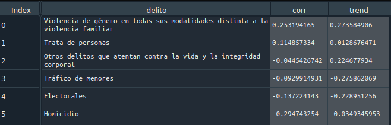
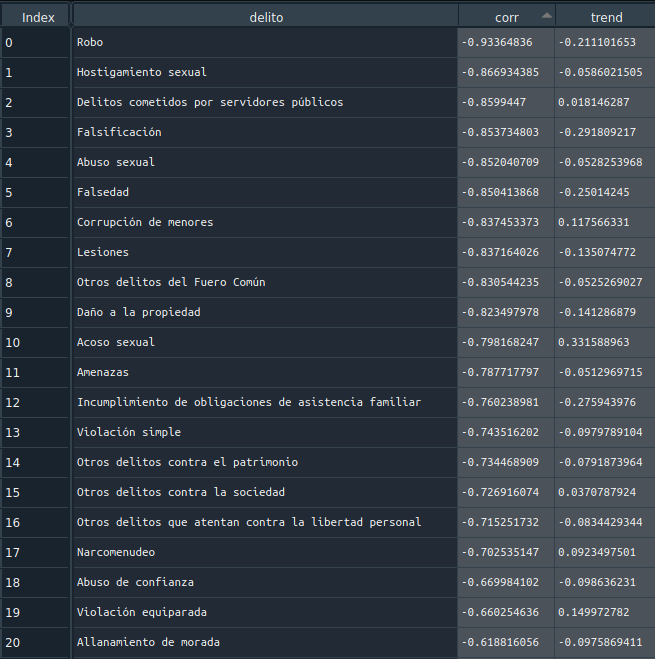
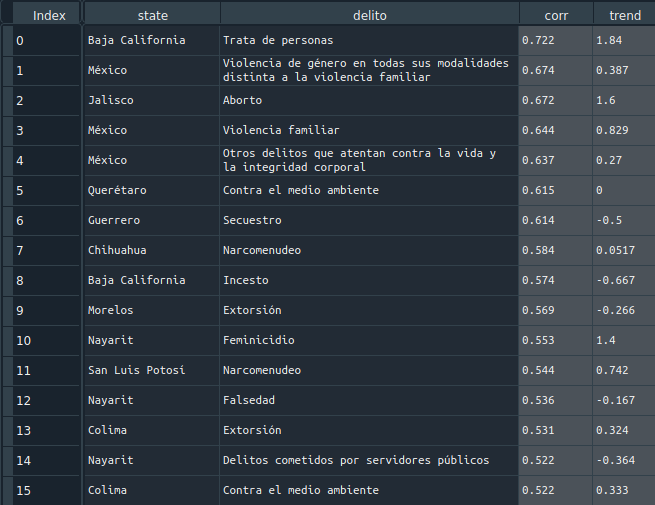
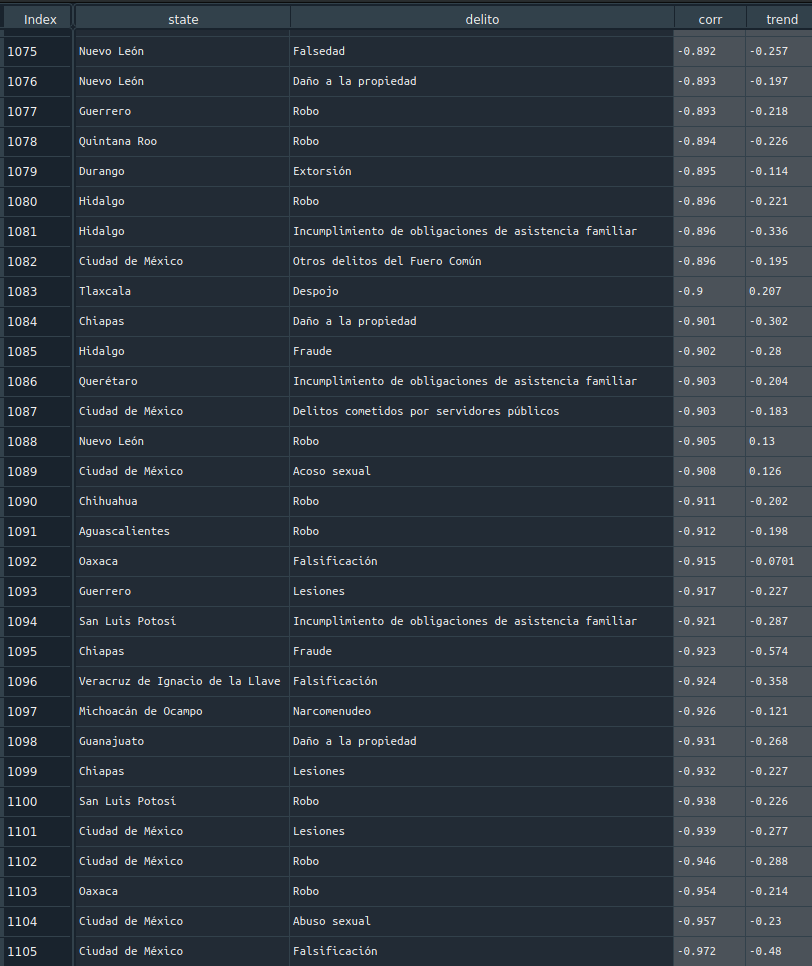

# Desafío Data México
## El impacto del COVID-19 #ECONOMÍACONDATOS

### ¿Cuales delitos son los que aumentaron durante la cuarentena, a nivel estatal y federal? 

Se utilizaron los Datos Abiertos de Incidencia Delictiva del Secretariado Ejecutivo del Sistema Nacional de Seguridad Pública y los Informes de movilidad comunitaria de Google. Se calculó la correlación de la movilidad residencial con la incidencia delictiva 
en una serie de tiempo, ademas de calcular su tendencia y una predicción del tiempo desde que comenzó la epidemia en México para visualizar patrones anormales.

Los resultados muestran los delitos con las correlaciones más altas, ya sea negativa o positivamente proporcional.

A nivel nacional:

 - El delito de "**Violencia de género en todas sus modalidades distinta a la violencia familiar**", obtuvo la correlación más alta de 0.253 y un aumento respecto al año pasado de 0.273.
   
 
 - El delito "**Trata personas**" obtuvo una correlación de 0.114 y un aumento respecto al año pasado de 0.0128
    
 
 - El delito de "**Robo**" obtuvo la correlación negativa más alta de -0.933 y un decremento respecto al año pasado de -0.211
    
 
 - El delito de "**Hostigamiento sexual**" obtuvo una correlación negativa de -0.866 y un decremento respecto al año pasado de -0.058
  
 
A nivel estatal:

 
 
 

 - El delito de "**Trata de personas**" en Baja California, obtuvo la correlación más alta de 0.722 y un aumento respecto al año pasado de 1.84.
  
 
 - El delito de "**Violencia de género en todas sus modalidades distinta a la violencia familiar**" en el Estado de México,
   obtuvo una correlación de 0.674 y un aumento respecto al año pasado de 0.387.
  
 
 - El delito de "**Aborto**" en Jalisco, obtuvo una correlación de 0.672 y un aumento respecto al año pasado de 1.6.
  
 
 - El delito de "**Violencia familiar**" en el Estado de México, obtuvo una correlación de 0.644 y un aumento respecto al año pasado de 0.829.
  
 
 - El delito de "**Otros delitos que atentan contra la vida y la integridad corporal**" en el Estado de México, obtuvo una correlación de 0.637 y un aumento respecto al año pasado de 0.27.
 
 
 - El delito de "**Falsificación**" en la Ciudad de México, obtuvo la correlación negativa más alta de -0.972 y un decremento respecto al año pasado de -0.48.
  
 
 - El delito de "**Abuso sexual**" en la Ciudad de México, obtuvo una correlación negativa de -0.957 y un decremento respecto al año pasado de -0.23.
 

- El delito de "**Robo**" en la Oaxaca, obtuvo una correlación negativa de -0.954 y un decremento respecto al año pasado de -0.214.
  

### NOTAS

 - El modelo utilizado para predecir las series de tiempo fue Facebook Prophet
 - Los datos de movilidad se escalaron respecto a los crímenes para un fin visual, pero no para la correlación.
 - Se utilizaron los datos de movilidad respecto a cada estado de la república mexicana.
 - Las bases de la competencia se encuentran en este [archivo](https://github.com/Duque-Paola/Data_Mexico/blob/master/Data%20M%C3%A9xico_Desafio_COVID-19.pdf)
 - [Reporte del proyecto](https://github.com/Duque-Paola/Data_Mexico/blob/master/reto_data_mexico.pdf)
 
### Bibliografía
 
 - Google Community Mobility Reports: https://www.google.com/covid19/mobility/
 - Datos Abiertos de Incidencia Delictiva del Secretariado Ejecutivo del Sistema Nacional de Seguridad Pública: https://www.gob.mx/sesnsp/acciones-y-programas/datos-abiertos-de-incidencia-
delictiva?state=published

 
 
 
 
 
 
